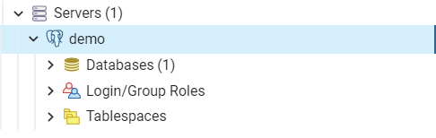
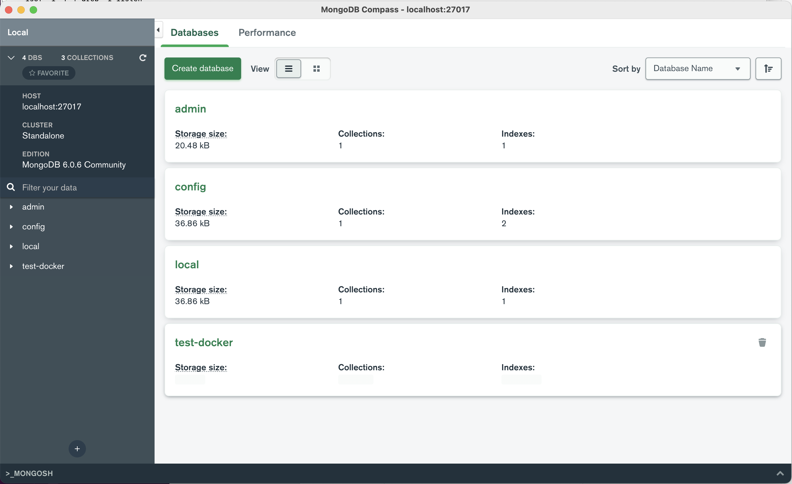

# Tutorial de instalación y uso de Docker, MongoDB y PostgreSQL

  

## Paso 1: Registro en Docker e instalación de Docker Desktop

1.- Entra en https://hub.docker.com/ y haz click en el botón "Register" en la esquina superior derecha, completa el registro.

---
  
### WINDOWS
2.- Descarga Docker Desktop para Windows desde este [enlace](https://www.docker.com/products/docker-desktop)
  
Una vez descargado, abre el instalador y sigue las instrucciones en pantalla (selecciona "use WSL2 instead of Hyper-V" cuando te lo pregunte)

Tras la instalación, reinicia tu sistema.

---
### macOS 

2.- Instalar [Docker](https://docs.docker.com/desktop/install/mac-install/).
Descargar dmg, arrastrar a carpeta aplicaciones
 
---

3.- Verifica que Docker se instaló correctamente abriendo una terminal y ejecutando el siguiente comando:
  

```docker --version```


Deberías ver algo similar a:

``Docker version XX.XX.X, build 55c4c88``

En la terminal, ejecuta 

`docker run docker/whalesay cowsay boo`

Deberías ver algo como esto 

```bash
_____ 
< boo >
 ----- 
    \
     \
      \     
                    ##        .            
              ## ## ##       ==            
           ## ## ## ##      ===            
       /""""""""""""""""___/ ===        
  ~~~ {~~ ~~~~ ~~~ ~~~~ ~~ ~ /  ===- ~~~   
       \______ o          __/            
        \    \        __/             
          \____\______/   
```


  

## Paso 2: Creación y uso de contenedores Docker de PostgreSQL


Debemos crear los contenedores de Docker para PostgreSQL.

*En macOS, asegurate de que Docker Desktop está abierto de esta forma se inicia un proceso en segundo plano que permite ejecutar los comandos por terminal*


Ejecuta este comando para ello:


``docker run --name some-postgres -e POSTGRES_PASSWORD=<your_password> -d -p 5432:5432 postgres``


Reemplaza '&lt;your_password&gt;' con '123456'

*En macOS puede solicitar ejecutar el comando como super usuario, añadir* sudo *al comienzo del comando*

## Paso 3: Acceso a los contenedores con pgAdmin4

  
### PgAdmin4

 - Descarga e instala pgAdmin4:
   - [Windows](https://www.pgadmin.org/download/)
   - [macOS](https://www.postgresql.org/ftp/pgadmin/pgadmin4/v7.1/macos/)

 - Inicia pgAdmin4

 - Haz clic en "Add New Server".

 - En la pestaña "General", asigna un nombre a la conexión, da igual
   cual sea.


En la pestaña "Connection", introduce:

 - En "hostname" : localhost
 - En "Port": 5432
 - En Maintenance Database : postgres
 - En Username: postgres
 - Utiliza el password que utilizaste al crear el contenedor &rarr; 123456
 - Marca "Save Password"

Haz clic en "Save" para guardar la conexión.\


¡Ahora deberías poder interactuar con tu base de datos PostgreSQL a través de pgAdmin4!

Deberías poder ver la conexión a la izquierda en PG Admin 4:




## Paso 4: Pasos para crear y usar contenedor de MongoDB


Ejecuta este comando para ello:

``docker run --name some-mongo -d -p 27017:27017 mongo``


### MongoDB Compass

Compass es el visor de las bases de datos de MongoDB, para utilizarlo sigue los siguientes pasos:


 - Descarga e instala MongoDB Compass: 
    - [Windows](https://www.mongodb.com/try/download/compass)
    - [macOS](https://www.mongodb.com/try/download/compass) v.1.37 (stable), usar dmg 
    <p></p>


 - Inicia MongoDB Compass.
   
     
 - En el campo "URI", introduce 'mongodb://localhost:27017' y haz clic  
   en "Connect".
   
 Deberías poder ver las bases de datos del contenedor:
 
 


Fuentes 

[docker macOS](https://docs.docker.com/desktop/install/mac-install/)\
[docker Windows](https://docs.docker.com/desktop/install/windows-install/)\
[pgAdmin](https://www.pgadmin.org/download/)\
[compass](https://www.mongodb.com/products/compass)\
[docker postgresql](https://hub.docker.com/_/postgres)\
[docker mongo](https://hub.docker.com/_/mongo)
